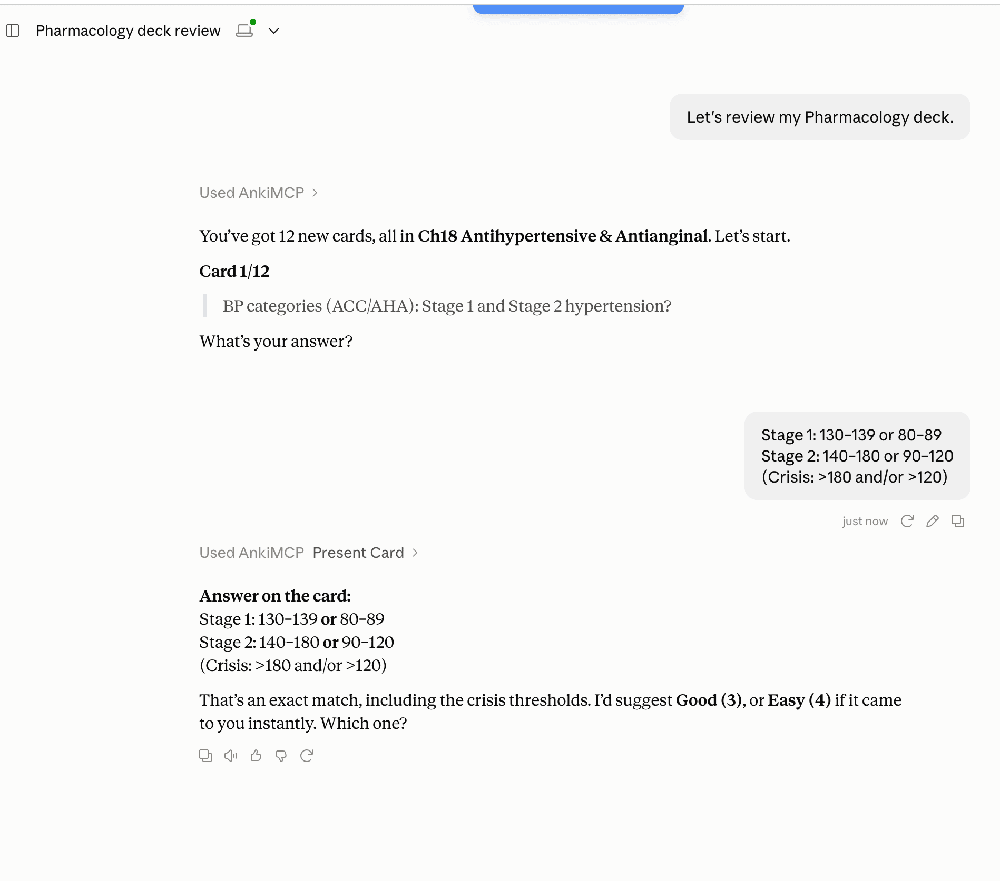

**"Anki AI" isn't one product. Anki itself has no AI that writes cards, so "Anki AI" means pairing Anki with an outside AI tool. There are four ways to do it: a web app that generates a deck, an add-on inside Anki, a chatbot you copy from, or an AI assistant connected straight to your collection. For a one-off deck from a PDF, a generator is fastest. To build, fix, and review cards in your real decks, connect an assistant like Claude or ChatGPT.**

This page compares all four in plain words: what each one does, what it costs you in setup, and who it suits. AnkiMCP is one of the four. We'll say where the others are the better choice.

## Does Anki have AI built in?

No. Anki doesn't write cards, explain answers, or chat with you. Everything on your cards comes from you, or from a shared deck someone else made.

Anki does use a kind of machine learning in one place: scheduling. Modern Anki includes **FSRS**, a scheduler that learns from your review history to decide when each card should come back. It's smart about *timing*, but it never touches what's *on* the card. You can read how it works in [The Power of Anki](/docs/concepts/power-of-anki/#what-is-fsrs).

One more mix-up worth clearing: if you search "Anki AI," you may also find a robotics company called Anki that made the Cozmo and Vector toy robots. That's a different company, unrelated to the flashcard app, and it shut down in 2019 ([Wikipedia](https://en.wikipedia.org/wiki/Anki_(American_company))).

## The four ways to use AI with Anki

Each approach puts the AI in a different spot. That spot decides what the AI can see and do.

### 1. AI flashcard generators (web apps)

You upload a PDF, slides, or notes to a website. The AI writes a deck, and you download it as an `.apkg` file and import it into Anki. Examples include [AnkiDecks](https://anki-decks.com/) and [Ankify](https://www.ankify.app/).

- **Good at:** turning a big document into a lot of cards fast. No setup in Anki.
- **Watch out for:** it's one-way. The cards go through export and import, so the generator can't see or update your existing decks. Most are paid, often with a free trial or limit. Cards can come out generic, so plan to review them. They don't help you study the cards afterward.
- **Best for:** someone who wants a starter deck from a single document and will study it the normal way.

### 2. AI add-ons inside Anki

These are add-ons you install into the Anki desktop app from AnkiWeb. Most ask you to paste in your own API key from an AI company, then they work on the cards you already have. Examples include the add-ons named [Anki AI](https://ankiweb.net/shared/info/643253121) and [Anki AI Copilot](https://ankiweb.net/shared/info/2025621808).

- **Good at:** improving cards you already own, for example filling a field, adding an explanation, or suggesting a memory trick, right where you study.
- **Watch out for:** desktop only, since add-ons don't run in AnkiWeb, AnkiMobile, or AnkiDroid. API keys take a little setup and you pay the AI company per use. Add-ons can break when Anki updates. Each one does a fixed set of jobs, so you can't just talk it through a review.
- **Best for:** desktop users who want one specific AI feature built into their usual Anki screens.

### 3. A chatbot, plus copy and paste

You ask ChatGPT, Claude, or any chatbot to write cards as text. Then you paste them into Anki one by one, or ask for a tab-separated list and bring it in with Anki's **File → Import**.

- **Good at:** costs nothing extra and works today. You already know how to use it. For better results, start from tested [prompts for Anki cards](/docs/how-to/anki-ai-prompts/#copy-paste-prompts-that-work-in-any-ai).
- **Watch out for:** it's all manual. The chatbot can't see your decks, so it doesn't know what you already have and can't avoid duplicates. Fixing a card means doing it by hand in Anki. It can't run a review with you.
- **Best for:** trying AI cards for the first time, or making a handful now and then.

### 4. An AI assistant connected to Anki (MCP)

Here the AI gets tools to work with your live Anki collection directly. This uses **MCP**, an open standard for connecting AI assistants to apps ([what MCP is](/docs/concepts/what-is-mcp/)). **AnkiMCP** (sometimes written Anki MCP) is an open-source MCP server for Anki, and it's what these docs cover.

Once connected, you just talk to the assistant. It can create cards in the right deck, search and edit notes you already have, add images and audio, and quiz you: it shows a card, you answer, and it rates the card in Anki so your schedule updates. It works with Claude, ChatGPT, Grok, and other MCP-capable apps.

- **Good at:** two-way work on your real decks, with no export or import. Reviewing in conversation, including [by voice](/docs/how-to/review-anki-by-voice/). Building cards while you read and chat.
- **Watch out for:** Anki needs to be open on your computer while the AI works, unless you use [Hosted Anki](/docs/hosted-anki/), which runs Anki in the cloud. There's a one-time setup to connect your assistant. Using it from ChatGPT needs a Plus plan or higher.
- **Cost:** the AnkiMCP add-on is free and open source. Web assistants reach your computer through a tunnel that has a [free tier and a paid tier](/pricing/). Hosted Anki is part of the paid Pro plan. You also need your AI app itself.
- **Best for:** people who study in Anki every day and want an assistant that can build, clean up, and review their actual collection.

## Which Anki AI option should you use?

| Option | Best for | Setup | Cost | Can review with you? |
| --- | --- | --- | --- | --- |
| **AI flashcard generator** | A deck from one PDF or set of notes | None in Anki; upload and import | Usually paid, often with a free trial | No |
| **AI add-on inside Anki** | One AI feature on cards you already have | Install add-on, add an API key | Add-on often free; you pay for AI use | No |
| **Chatbot + copy/paste** | A few cards, now and then | None | Free with a free chatbot plan | No |
| **AI assistant via MCP (AnkiMCP)** | Building, editing, and reviewing your real decks | One-time connection | Add-on free; tunnel has free and paid tiers | **Yes** |

A quick way to decide:

- **If you have one PDF and an exam next week,** use a generator, or [turn the PDF into cards with your AI assistant](/docs/how-to/pdf-to-anki/).
- **If you want one AI button inside Anki's own editor,** try an add-on.
- **If you just want to see what AI cards look like,** ask a chatbot and paste the result.
- **If you want an assistant that knows your decks and can quiz you, connect it with AnkiMCP.**

You can also mix them. Many people make a first deck one way and then use an assistant to fix and review it.

## Common questions

**Is Anki AI-powered?**
Not in the way chatbots are. Anki doesn't generate or explain content. Its FSRS scheduler uses your review history to time reviews, which is a form of machine learning, but card writing and tutoring come from separate AI tools.

**What is the best AI for Anki?**
It depends on the job. For bulk cards from a document, a generator is quickest. For working inside your existing decks and reviewing with you, a connected assistant like Claude or ChatGPT through AnkiMCP does more. Any capable chatbot can write decent cards if you give it [a good prompt](/docs/how-to/anki-ai-prompts/).

**Can AI make Anki cards for me?**
Yes. All four approaches above can. The difference is how the cards get into Anki: a downloaded file, an add-on, copy and paste, or directly into the deck you choose. Either way, read the cards before you study them. AI makes mistakes.

**Is there an Anki AI add-on?**
Yes, several. One is literally named "Anki AI," and there's also "Anki AI Copilot." The AnkiMCP add-on (code `124672614`) is different: it doesn't call an AI itself. It lets the AI assistant you already use reach your Anki.

**Does AnkiMCP work with ChatGPT or only Claude?**
Both, and more. There are guides for [Claude](/docs/how-to/connect-claude/), [ChatGPT](/docs/how-to/connect-chatgpt-to-anki/), and [Grok](/docs/how-to/connect-grok-to-anki/), plus [Cursor, Cline, and other MCP apps](/docs/how-to/connect-mcp-clients/).

## Next steps

- [Get started with AnkiMCP](/docs/get-started/)
- [Connect Claude to Anki](/docs/how-to/connect-claude/)
- [Connect ChatGPT to Anki](/docs/how-to/connect-chatgpt-to-anki/)
- [AI prompts for Anki flashcards](/docs/how-to/anki-ai-prompts/)
- [Turn a PDF into Anki cards](/docs/how-to/pdf-to-anki/)
- [What is MCP?](/docs/concepts/what-is-mcp/)
- [How Anki and AI work together](/docs/concepts/how-anki-mcp-works/)
- [The Power of Anki: why spaced repetition works](/docs/concepts/power-of-anki/)

---

*Disclaimer: "Anki" is a registered trademark of Ankitects Pty Ltd. AnkiMCP is an independent, community-built project and is **not** affiliated with, endorsed by, or sponsored by Ankitects. MCP is an open standard originated by Anthropic; AnkiMCP is likewise not affiliated with or endorsed by Anthropic.*
