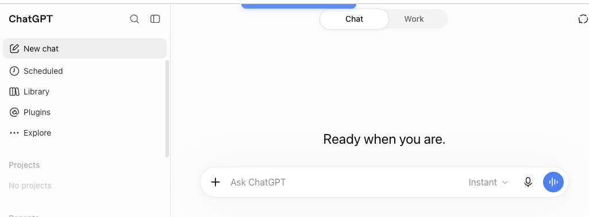
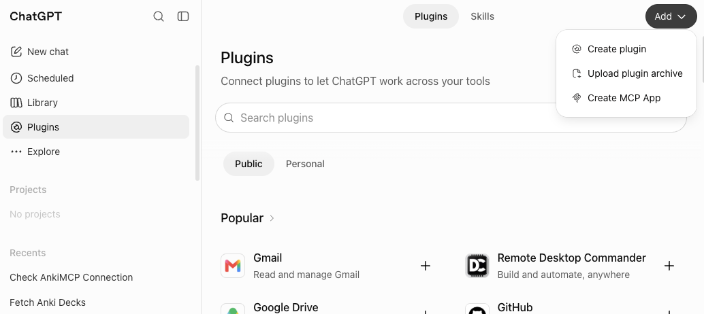
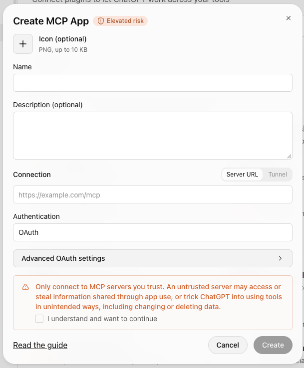
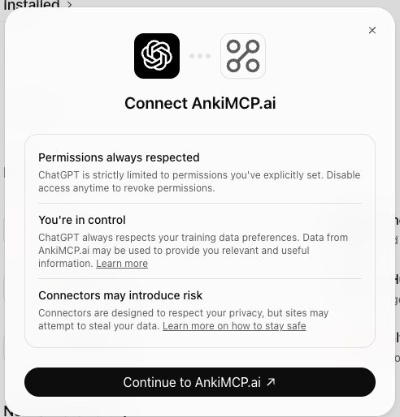
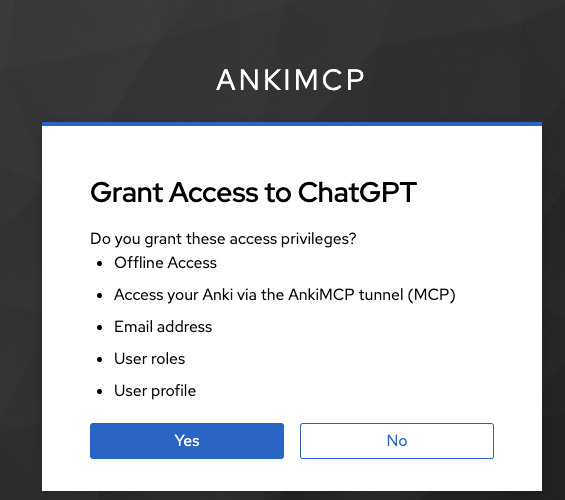
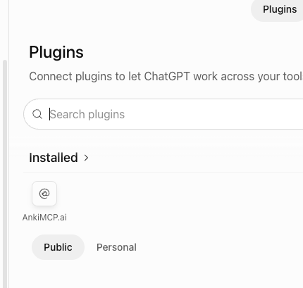
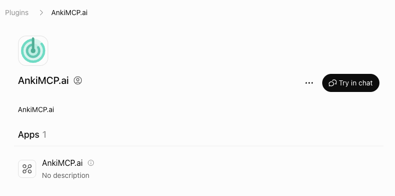
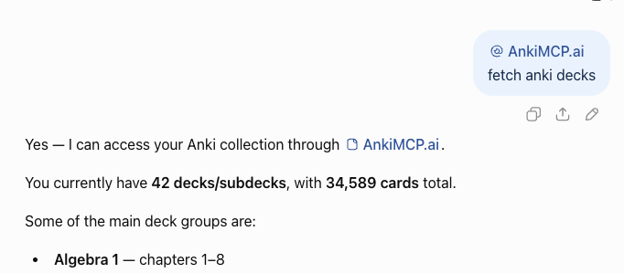

**Conecte o ChatGPT ao Anki com o túnel embutido no add-on do AnkiMCP, para que o ChatGPT leia seus baralhos e crie cards direto do navegador.**

O ChatGPT roda na nuvem, então ele não enxerga o Anki no seu computador. O **add-on** do AnkiMCP resolve isso. Ele roda dentro do Anki e, com um clique, dá à sua coleção um endereço web público e seguro que o ChatGPT consegue acessar. Você liga o túnel, entra na sua conta uma vez e cola o endereço no ChatGPT.

## O que você precisa

- Uma **conta no ChatGPT** no plano **Plus ou superior**. Você vai adicionar o túnel como um app MCP em **Plugins**, e este guia foi testado no Plus. Para os detalhes de quais planos incluem apps MCP, veja a [página Developer mode and MCP apps](https://help.openai.com/en/articles/12584461-developer-mode-and-mcp-apps-in-chatgpt) da OpenAI (em inglês).
- **Anki 25.07 ou mais recente**, aberto no seu computador. Baixe em [apps.ankiweb.net](https://apps.ankiweb.net/).
- O **add-on AnkiMCP** para o Anki, código `124672614`. Você instala ele logo abaixo.
- Uma **conta AnkiMCP**. O túnel tem um [plano gratuito e um plano pago](/pt-br/pricing/). Você entra na conta na primeira vez que conectar.

**Tempo:** cerca de 5 minutos.

## Por que um túnel?

O ChatGPT roda em um servidor remoto, não na sua máquina. Ele não tem como alcançar o `localhost`, onde o Anki fica. O túnel do add-on repassa as mensagens entre o ChatGPT e o seu Anki local por uma conexão segura e autenticada. Seus cards continuam sob seu controle, e o link é privado da sua conta.

## Passo 1: instale o add-on AnkiMCP

O add-on sobe um pequeno servidor dentro do Anki. Ele inicia sozinho toda vez que você abre o Anki.

1. Abra o Anki.
2. Vá em **Ferramentas (Tools) → Extensões (Add-ons) → Obter extensões... (Get Add-ons...)**
3. Digite este código: `124672614`
4. Clique em **OK** e reinicie o Anki.


## Passo 2: conecte o túnel e entre na sua conta

Agora ligue o túnel para que o seu Anki ganhe um endereço web público.

1. Vá em **Ferramentas (Tools) → AnkiMCP Server Settings...**
2. Clique em **Connect Tunnel**.
3. Uma janela de login mostra um código de uso único. Clique em **Open Browser** e digite esse código na página que abrir.
4. Aprove o acesso. O add-on guarda o seu login, então você não precisa repetir isso toda vez.


## Passo 3: copie a URL do túnel

O endereço do túnel é o mesmo para todo mundo:

```text
https://tunnel.ankimcp.ai/mcp
```

Pode compartilhar sem medo, porque ele só funciona depois que você entra na conta — as requisições chegam ao seu Anki apenas quando o app de IA está conectado com a **sua** conta. Copie essa URL. Você vai colar ela no ChatGPT a seguir.


## Passo 4: adicione o túnel no ChatGPT

Abra o [chatgpt.com](https://chatgpt.com) no navegador e adicione o túnel como um app MCP.

1. Na barra lateral esquerda, clique em **Plugins**.



2. Na página **Plugins**, clique em **Adicionar (Add)** no canto superior direito e escolha **Criar app MCP (Create MCP App)**. Se **Create MCP App** não aparecer, ative primeiro o **Modo desenvolvedor (Developer mode)** em **Configurações (Settings) → Segurança e login (Security and login)**.



3. A janela **Criar app MCP (Create MCP App)** abre. Preencha assim:
   - **Nome (Name)**: algo como `AnkiMCP.ai`. O ícone e a descrição são opcionais.
   - **Conexão (Connection)**: mantenha **URL do servidor (Server URL)** selecionado e cole a URL do seu túnel. Ignore a opção **Tunnel** — é um recurso do próprio ChatGPT, não o túnel do AnkiMCP.
   - **Autenticação (Authentication)**: deixe em **OAuth**. Não abra **Advanced OAuth settings**; o ChatGPT lê as configurações certas a partir da URL.
   - Marque **Entendi e quero continuar (I understand and want to continue)** para aceitar o aviso de risco do ChatGPT sobre MCP personalizado e clique em **Criar (Create)**.



4. O ChatGPT mostra a tela **Connect AnkiMCP.ai**, explicando as permissões. Clique em **Continue to AnkiMCP.ai**.



5. O AnkiMCP abre e pede para você **conceder acesso ao ChatGPT (Grant Access to ChatGPT)**. Entre na conta se for pedido e clique em **Yes**.



6. De volta ao ChatGPT, o AnkiMCP.ai aparece em **Instalados (Installed)** na página Plugins. Clique nele para abrir os detalhes, onde o botão **Try in chat** começa uma conversa com o plugin pronto para usar.





## Confira se funcionou

Deixe o Anki aberto, comece um chat, digite `@`, escolha **AnkiMCP.ai** na lista e peça: **"buscar meus baralhos do Anki"**.

Se ele disser o nome dos seus baralhos de verdade e a quantidade de cards, o túnel está funcionando. Agora você pode pedir para ele criar cards, buscar na sua coleção ou revisar com você. Mencionar o plugin com `@` diz ao ChatGPT para usá-lo naquela mensagem; depois da primeira vez, ele costuma escolher o AnkiMCP.ai sozinho sempre que você falar do Anki.



## Resolva problemas comuns

**O ChatGPT não consegue conectar.**
Confira se o Anki está aberto e se o túnel aparece como conectado em **Ferramentas (Tools) → AnkiMCP Server Settings...**. O túnel só repassa mensagens enquanto o Anki está rodando. Se precisar, conecte o túnel de novo.

**O ChatGPT conecta, mas não vê nenhum baralho.**
O próprio Anki pode estar fechado. Abra o Anki e confirme que o túnel está conectado em **Ferramentas (Tools) → AnkiMCP Server Settings...**.

**O login não abriu meu navegador.**
A janela de login mostra um link e um código reserva. Abra o link e digite o código para aprovar.

## Perguntas frequentes

**Eu preciso pagar?**
O add-on é gratuito. O túnel tem um plano gratuito para começar e um plano pago com limites maiores — veja os [preços](/pt-br/pricing/).

## Próximos passos

- Não sabe a diferença entre acesso local e remoto? Leia [Acesso remoto x local](/docs/concepts/remote-vs-local/) (em inglês) para escolher o melhor caminho.
- Quer cards melhores? Experimente estes [prompts de IA para o Anki](/pt-br/docs/how-to/anki-ai-prompts/).

---

*Aviso: "Anki" é uma marca registrada da Ankitects Pty Ltd. O AnkiMCP é um projeto independente, criado pela comunidade, e **não** tem vínculo com a Ankitects, nem é endossado ou patrocinado por ela. MCP é um padrão aberto criado pela Anthropic; o AnkiMCP também não tem vínculo com a Anthropic nem é endossado por ela.*
