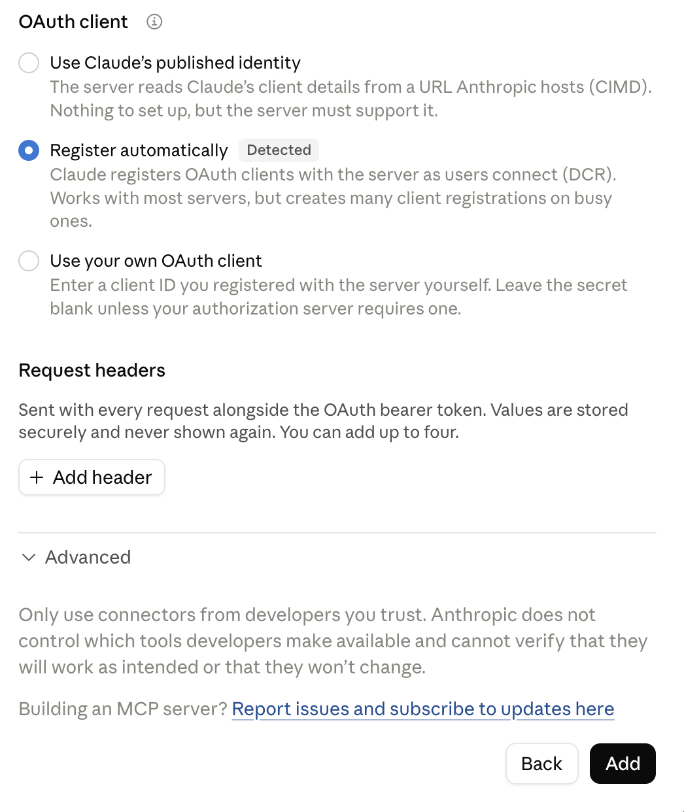
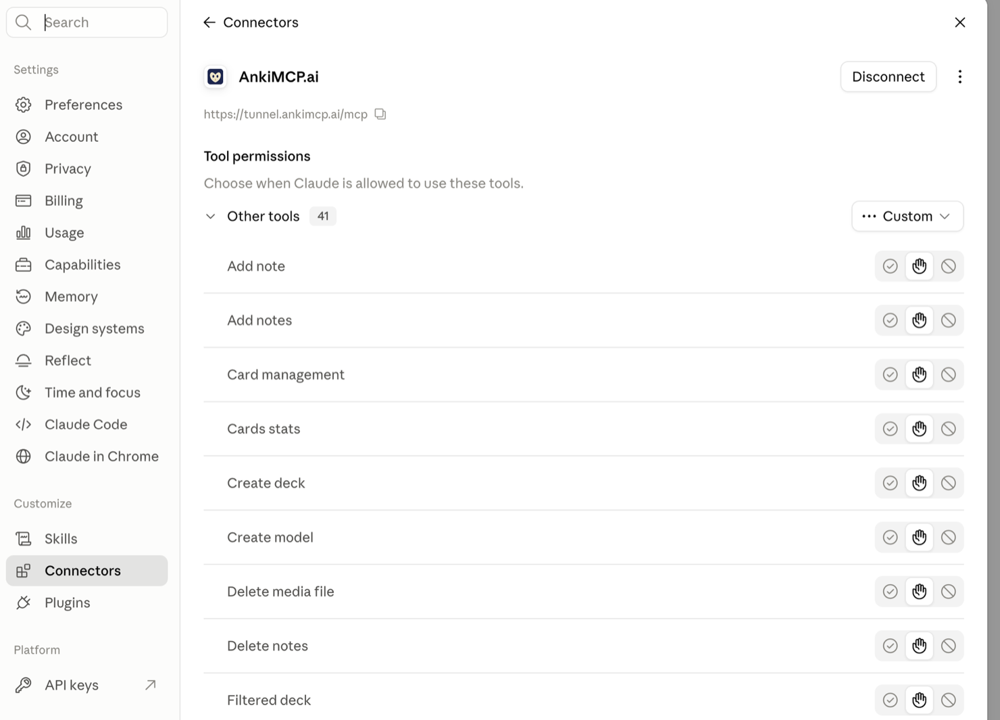

**Connect Anki to Claude in about 5 minutes, so Claude can read your decks and build cards for you. Pick the path that matches where you use Claude: the web, the desktop app, or Claude Code in your terminal.**


**Set up the Web path once and you get Claude everywhere.** The AnkiMCP add-on's built-in tunnel ties the connector to your Claude account, not to one app. So that single setup also reaches **Claude on your phone** and **Claude Code** — anywhere you sign in to Claude. In short: set up the Web path once, and it also works on mobile and in Claude Code. If you want Anki in Claude on more than one device, start with the **Claude Web** tab below.






**Set it up once and Claude reaches your Anki on every device. Install the AnkiMCP add-on, turn on its built-in tunnel, and add the tunnel address to claude.ai. After that, Claude can read your decks and build cards from the web, the desktop app, and your phone.**

The AnkiMCP add-on runs inside Anki and gives your collection a secure web address. You add that address to claude.ai once. Because the connector is tied to your Claude account, it then works everywhere you sign in to Claude.

### What you need

- **Anki 25.07 or later**, open on your computer. Get it from [apps.ankiweb.net](https://apps.ankiweb.net/).
- The **AnkiMCP add-on** for Anki, code `124672614`. You'll install it below.
- An **AnkiMCP account**. The tunnel has a [free tier and a paid tier](/pricing/). You sign in the first time you connect it.
- A **Claude account** at [claude.ai](https://claude.ai).

**Time:** about 5 minutes.

### Why claude.ai needs the tunnel

Claude on the web runs in Anthropic's cloud, not on your computer. It can't see Anki on your machine on its own. The **tunnel** gives your local Anki a secure public web address that Claude can reach. Anki stays on your computer; the tunnel only relays messages to it.

### Step 1: Install the AnkiMCP add-on

The add-on starts a small server inside Anki. It launches on its own every time you open Anki.

1. Open Anki.
2. Go to **Tools → Add-ons → Get Add-ons...**
3. Enter this code: `124672614`
4. Click **OK**, then restart Anki.


### Step 2: Connect the tunnel and sign in

Now turn on the tunnel so your Anki gets a public web address.

1. Go to **Tools → AnkiMCP Server Settings...**
2. Click **Connect Tunnel**.
3. A login dialog shows a one-time code. Click **Open Browser** and enter that code on the page that opens.
4. Approve the sign-in. The add-on saves your login, so you won't repeat this each time.


### Step 3: Copy the tunnel URL

The tunnel address is the same for everyone:

```text
https://tunnel.ankimcp.ai/mcp
```

It's safe to share, because it only works after you sign in — requests reach your Anki only when the AI app is signed in with **your** account. Copy that URL. You'll paste it into claude.ai next.


### Step 4: Add the connector in claude.ai

Open [claude.ai](https://claude.ai) in your browser and add the tunnel as a custom connector.

1. In the sidebar, click **Customize**, then open **Connectors**.
2. Click **Add**. The **Add custom connector** window opens.
3. Give the connector a name, such as `AnkiMCP`, paste your tunnel URL into **MCP server URL**, and click **Continue**.


4. Claude checks the address and shows sign-in options. It picks the right ones on its own — the choices it found are marked **Detected**. Don't change anything. Scroll to the bottom and click **Add**.



5. Claude asks you to sign in to AnkiMCP — sign in and approve access. When it's done, the connector shows a **Disconnect** button and the list of Anki tools Claude can use.



For the exact menu path, see Anthropic's [custom connectors guide](https://support.claude.com/en/articles/11175166-get-started-with-custom-connectors-using-remote-mcp).

### It works everywhere

You added the connector to your Claude account, not to one app. So it follows you across every place you sign in to Claude:

- **Claude on the web** at claude.ai.
- The **Claude desktop app** on Mac and Windows.
- **Claude mobile** on iOS and Android. Mobile connector support is **in beta**.

After you sign in on a new device, the connector syncs to it. You don't repeat the setup.

One rule stays the same everywhere: **Anki must stay open** on your computer. The tunnel relays to your local Anki. It is not a cloud copy of your cards.

### Check it worked

With Anki open on your computer, ask Claude: **"List my Anki decks."**
If Claude names your real decks, the connector works on every device.





**Connect the Claude Desktop app to Anki by dragging one bundle file into Claude's settings, so Claude can read your decks and build cards for you.**

This is the free, local way to use Claude with your cards. You drop the AnkiMCP bundle into Claude Desktop, keep Anki open, and you're done. No Node.js, no config files, no coding. It works in the Claude Desktop app on this one computer.

### What you need

- **Claude Desktop**, installed from [claude.ai/download](https://claude.ai/download).
- **Anki** on the same computer, open, with the **AnkiConnect add-on** (code `2055492159`). You'll add it in Step 1.
- The **AnkiMCP bundle**, a `.mcpb` file. You'll download it in Step 2.

**Time:** about 5 minutes.

The **`.mcpb` bundle** is a single file that holds the whole AnkiMCP server. Claude Desktop installs it as an extension and runs it for you.

### Step 1: Install AnkiConnect in Anki

AnkiConnect is the add-on that lets the bundle reach your collection.


**AnkiConnect (code `2055492159`) and the AnkiMCP add-on (code `124672614`) are two different add-ons.** For this Desktop path, install **AnkiConnect**.


1. Open Anki.
2. Go to **Tools → Add-ons → Get Add-ons...**
3. Enter this code: `2055492159`
4. Click **OK**, then restart Anki.

To confirm it works, open [http://localhost:8765](http://localhost:8765) in your browser. You should see the plain text `AnkiConnect`.


### Step 2: Download the AnkiMCP bundle

Get the latest `.mcpb` file from the [AnkiMCP Releases page](https://github.com/ankimcp/anki-mcp-server/releases). Save it somewhere you can find it, like your Downloads folder.

### Step 3: Install the bundle in Claude Desktop

In Claude Desktop, go to **Settings → Extensions**. Drag and drop the `.mcpb` file into the window, then click **Install**.

The bundle self-configures the AnkiConnect address to `http://localhost:8765`. You don't need to change it.


### Step 4: Restart Claude Desktop

Quit Claude Desktop fully, then open it again. Keep Anki open. Claude reaches your cards only while Anki is running.

### Where this works (and how to get it everywhere)

This bundle runs **locally**, next to Anki. That makes it free and private. But it lives in the Claude Desktop app on **this one computer only**.


**This connection is desktop-only.** It will **not** appear in Claude on the web or on your phone. If you want Anki in Claude **everywhere** — web, desktop, and mobile, synced to your account — set it up through the AnkiMCP add-on instead. That's the better path for global access. See the [Claude Web](/docs/how-to/connect-claude/#claude-web) tab.


The web path uses the managed tunnel (free and paid tiers), so Claude can reach your computer from anywhere. The Desktop bundle here is the fastest free way to try Claude with your cards, and you can add the web connector later.

### Check it worked

With Anki open, ask Claude Desktop: **"List my Anki decks."**

If Claude names your decks, the connection works. You can now ask it to make cards, search your collection, or review with you.





**Connect Claude Code to Anki with one command, so Claude Code can read your decks and build cards while you work in the terminal.**

The fastest way is the **AnkiMCP add-on**. It runs a local server inside Anki, and you point Claude Code at it. Prefer no add-on? The **CLI** works too. Both are free and run on your computer. This setup lives in Claude Code only, not claude.ai.

### What you need

- **Claude Code** installed and working in your terminal.
- **Anki** open on the same computer. Claude Code reaches your cards only while Anki runs.
- For the add-on: **Anki 25.07 or newer**. Check in **Anki → About**.
- For the CLI: **Node.js 22.12.0 or newer** from [nodejs.org](https://nodejs.org/), plus the **AnkiConnect** add-on.

**Time:** about 5 minutes.

**MCP** (Model Context Protocol) is the open standard that lets AI tools like Claude Code talk to Anki. **STDIO** means Claude Code starts and runs the server itself, on your computer.

### Connect with the add-on (recommended)

The AnkiMCP add-on runs a local HTTP server inside Anki. It talks to Anki directly, so you don't need Node.js or the AnkiConnect add-on.

1. Open Anki and go to **Tools → Add-ons → Get Add-ons...**
2. Enter this code: `124672614`
3. Click **OK**, then restart Anki.

   The server starts on its own at `http://127.0.0.1:3141/`. You can check its status under **Tools → AnkiMCP Server Settings...**

4. In your terminal, add the server to Claude Code:

   ```bash
   claude mcp add --transport http anki http://127.0.0.1:3141/
   ```

   This adds the server at **local** scope (the current project only). To use it in every project, add `--scope user`:

   ```bash
   claude mcp add --scope user --transport http anki http://127.0.0.1:3141/
   ```

That's it. Keep Anki open so Claude Code can reach your cards.

### Or use the CLI

No add-on, or you prefer the command line? The CLI runs the AnkiMCP server over STDIO. It needs Node.js and the AnkiConnect add-on.

1. In Anki, go to **Tools → Add-ons → Get Add-ons...**, enter code `2055492159`, click **OK**, and restart Anki. To confirm it works, open [http://localhost:8765](http://localhost:8765) in your browser. You should see the text `AnkiConnect`.
2. In your terminal, add the server to Claude Code:

   ```bash
   claude mcp add --transport stdio anki -- npx -y @ankimcp/anki-mcp-server --stdio
   ```

   This adds the server at **local** scope. Add `--scope user` to use it in every project. Claude Code runs the server with npx, so you don't install anything else.

### Check it worked

List your servers to confirm the connection:

```bash
claude mcp list
```

You should see `anki` with a connected status. With Anki open, ask Claude Code: **"List my Anki decks."** If it names your decks, you're done. You can now ask it to make cards or search your collection.





## Common questions

**Does this work on my phone?**
Yes, through the Web path. Once the connector is on your Claude account, it appears in the Claude mobile app after you sign in. Mobile connector support is in beta, so some features may not work perfectly yet. The Desktop bundle and Claude Code setups stay on one computer and do not reach your phone.

**Which path should I pick?**
Want Anki in Claude on the web, your phone, and across devices? Use the **Claude Web** path (the add-on tunnel). Want a free, local-only setup in the Claude Desktop app? Use **Claude Desktop**. Working in the terminal? Use **Claude Code**.

**Add-on or CLI for Claude Code — which is better?**
Start with the add-on. It's one command and needs no Node.js or AnkiConnect, because it talks to Anki directly. Pick the CLI if you'd rather not install an add-on, or you already use AnkiConnect.

**Do I need to keep Anki open?**
Yes, for every path. Claude reaches your cards only while the Anki app is running.

**Is it free?**
The add-on and the Desktop bundle are free. The Web tunnel has a free tier to get started and a paid tier for more, because it gives your Anki a secure web address that claude.ai can reach.

**Does my computer have to stay on?**
Yes. Every path relays to the Anki app on your machine. Keep your computer on and Anki open while you study. If Anki is closed, Claude sees no cards.

**Claude can't reach Anki. What's wrong?**
For the Desktop bundle or the CLI, make sure Anki is open and AnkiConnect is installed. Open [http://localhost:8765](http://localhost:8765) in your browser. You should see `AnkiConnect`. If not, reinstall the AnkiConnect add-on with code `2055492159` and restart Anki. For the add-on, check **Tools → AnkiMCP Server Settings...** in Anki.

**Do I need Node.js?**
Only for the Claude Code CLI path. The Desktop bundle and the add-on include everything they need.

## Next steps

- New to local vs. remote? Read [Remote vs local access](/docs/concepts/remote-vs-local/) to understand when you need the tunnel.
- Ready to make cards? Try our [Anki AI prompts](/docs/how-to/anki-ai-prompts/).
- Use Cursor, Cline, or another tool? See [Connect coding tools](/docs/how-to/connect-mcp-clients/).

---

*Disclaimer: "Anki" is a registered trademark of Ankitects Pty Ltd. AnkiMCP is an independent, community-built project and is **not** affiliated with, endorsed by, or sponsored by Ankitects. MCP is an open standard originated by Anthropic; AnkiMCP is likewise not affiliated with or endorsed by Anthropic.*
