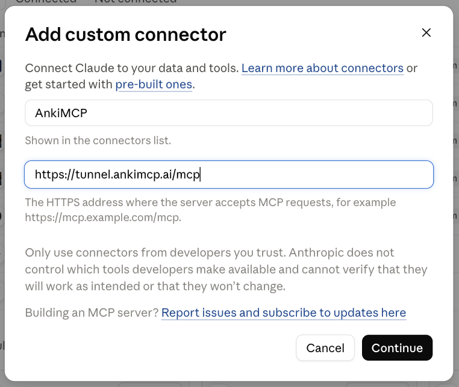

**Conecte o Anki ao Claude em cerca de 5 minutos, para que o Claude possa ler os seus baralhos e criar cards para você. Escolha o caminho que combina com o lugar onde você usa o Claude: a web, o app para desktop ou o Claude Code no seu terminal.**


**Configure o caminho Web uma vez e você tem o Claude em todo lugar.** O túnel embutido do add-on AnkiMCP liga o conector à sua conta do Claude, e não a um app específico. Então essa configuração única também alcança o **Claude no seu celular** e o **Claude Code** — em qualquer lugar onde você entre na sua conta do Claude. Resumindo: configure o caminho Web uma vez e ele também funciona no celular e no Claude Code. Se você quer o Anki dentro do Claude em mais de um dispositivo, comece pela aba **Claude Web** abaixo.






**Configure uma vez e o Claude alcança o seu Anki em todos os dispositivos. Instale o add-on AnkiMCP, ligue o túnel embutido e adicione o endereço do túnel no claude.ai. Depois disso, o Claude pode ler os seus baralhos e criar cards a partir da web, do app para desktop e do seu celular.**

O add-on AnkiMCP roda dentro do Anki e dá à sua coleção um endereço web seguro. Você adiciona esse endereço no claude.ai uma única vez. Como o conector fica ligado à sua conta do Claude, ele passa a funcionar em todo lugar onde você entrar no Claude.

### O que você precisa

- **Anki 25.07 ou mais recente**, aberto no seu computador. Baixe em [apps.ankiweb.net](https://apps.ankiweb.net/).
- O **add-on AnkiMCP** para o Anki, código `124672614`. Você vai instalá-lo abaixo.
- Uma **conta AnkiMCP**. O túnel tem um [plano gratuito e um plano pago](/pt-br/pricing/). Você entra na conta na primeira vez que conecta.
- Uma **conta do Claude** em [claude.ai](https://claude.ai).

**Tempo:** cerca de 5 minutos.

### Por que o claude.ai precisa do túnel

O Claude na web roda na nuvem da Anthropic, não no seu computador. Sozinho, ele não consegue enxergar o Anki na sua máquina. O **túnel** dá ao seu Anki local um endereço web público e seguro que o Claude consegue alcançar. O Anki continua no seu computador; o túnel só repassa as mensagens até ele.

### Passo 1: Instale o add-on AnkiMCP

O add-on inicia um pequeno servidor dentro do Anki. Ele sobe sozinho toda vez que você abre o Anki.

1. Abra o Anki.
2. Vá em **Ferramentas (Tools) → Extensões (Add-ons) → Obter extensões... (Get Add-ons...)**
3. Digite este código: `124672614`
4. Clique em **OK** e reinicie o Anki.


### Passo 2: Conecte o túnel e entre na sua conta

Agora ligue o túnel para que o seu Anki ganhe um endereço web público.

1. Vá em **Ferramentas (Tools) → AnkiMCP Server Settings...**
2. Clique em **Connect Tunnel**.
3. Uma janela de login mostra um código de uso único. Clique em **Open Browser** e digite esse código na página que abrir.
4. Aprove a entrada. O add-on salva o seu login, então você não precisa repetir isso toda vez.


### Passo 3: Copie a URL do túnel

O endereço do túnel é o mesmo para todo mundo:

```text
https://tunnel.ankimcp.ai/mcp
```

Pode compartilhar sem medo, porque ele só funciona depois que você entra na sua conta — as requisições chegam ao seu Anki apenas quando o app de IA está conectado com a **sua** conta. Copie essa URL. Você vai colá-la no claude.ai no próximo passo.


### Passo 4: Adicione o conector no claude.ai

Abra o [claude.ai](https://claude.ai) no seu navegador e adicione o túnel como um conector personalizado.

1. Na barra lateral, clique em **Personalizar (Customize)** e abra **Conectores (Connectors)**.
2. Clique em **Adicionar**. A janela **Adicionar conector personalizado (Add custom connector)** abre.
3. Dê um nome ao conector (por exemplo, AnkiMCP), cole a URL do seu túnel no campo **URL do servidor MCP** e clique em **Continuar**.
4. O Claude pede que você entre na sua conta AnkiMCP — entre e aprove o acesso.

Para o caminho exato do menu, veja o [guia de conectores personalizados](https://support.claude.com/pt/articles/11175166-comece-com-conectores-personalizados-usando-mcp-remoto) da Anthropic.



### Funciona em todo lugar

Você adicionou o conector à sua conta do Claude, e não a um app específico. Por isso ele te acompanha em todos os lugares onde você entra no Claude:

- **Claude na web**, em claude.ai.
- O **app Claude para desktop**, no Mac e no Windows.
- **Claude no celular**, no iOS e no Android. O suporte a conectores no celular está **em beta**.

Depois que você entra na sua conta em um novo dispositivo, o conector sincroniza para ele. Você não precisa repetir a configuração.

Uma regra continua valendo em todo lugar: **o Anki precisa ficar aberto** no seu computador. O túnel repassa tudo para o seu Anki local. Ele não é uma cópia dos seus cards na nuvem.

### Confira se deu certo

Com o Anki aberto no seu computador, peça ao Claude: **"Liste os meus baralhos do Anki."**
Se o Claude citar os seus baralhos de verdade, o conector está funcionando em todos os dispositivos.





**Conecte o app Claude Desktop ao Anki arrastando um único arquivo de pacote para as configurações do Claude, para que o Claude possa ler os seus baralhos e criar cards para você.**

Este é o jeito gratuito e local de usar o Claude com os seus cards. Você solta o pacote do AnkiMCP no Claude Desktop, mantém o Anki aberto e pronto. Sem Node.js, sem arquivos de configuração, sem programar. Funciona no app Claude Desktop, neste computador.

### O que você precisa

- O **Claude Desktop**, instalado a partir de [claude.ai/download](https://claude.ai/download).
- O **Anki** no mesmo computador, aberto, com o **add-on AnkiConnect** (código `2055492159`). Você vai instalá-lo no Passo 1.
- O **pacote do AnkiMCP**, um arquivo `.mcpb`. Você vai baixá-lo no Passo 2.

**Tempo:** cerca de 5 minutos.

O **pacote `.mcpb`** é um único arquivo que contém todo o servidor AnkiMCP. O Claude Desktop o instala como uma extensão e o executa para você.

### Passo 1: Instale o AnkiConnect no Anki

O AnkiConnect é o add-on que permite ao pacote alcançar a sua coleção.


**O AnkiConnect (código `2055492159`) e o add-on AnkiMCP (código `124672614`) são dois add-ons diferentes.** Para este caminho Desktop, instale o **AnkiConnect**.


1. Abra o Anki.
2. Vá em **Ferramentas (Tools) → Extensões (Add-ons) → Obter extensões... (Get Add-ons...)**
3. Digite este código: `2055492159`
4. Clique em **OK** e reinicie o Anki.

Para confirmar que funcionou, abra [http://localhost:8765](http://localhost:8765) no seu navegador. Você deve ver o texto simples `AnkiConnect`.


### Passo 2: Baixe o pacote do AnkiMCP

Pegue o arquivo `.mcpb` mais recente na [página de Releases do AnkiMCP](https://github.com/ankimcp/anki-mcp-server/releases). Salve em um lugar fácil de achar, como a sua pasta de Downloads.

### Passo 3: Instale o pacote no Claude Desktop

No Claude Desktop, vá em **Configurações (Settings) → Extensões (Extensions)**. Arraste e solte o arquivo `.mcpb` na janela e clique em **Instalar (Install)**.

O pacote se configura sozinho com o endereço do AnkiConnect `http://localhost:8765`. Você não precisa mudar nada.


### Passo 4: Reinicie o Claude Desktop

Feche o Claude Desktop por completo e abra de novo. Mantenha o Anki aberto. O Claude só alcança os seus cards enquanto o Anki estiver rodando.

### Onde isso funciona (e como ter em todo lugar)

Este pacote roda **localmente**, ao lado do Anki. É isso que o torna gratuito e privado. Mas ele vive no app Claude Desktop **apenas neste computador**.


**Esta conexão é só para o desktop.** Ela **não** vai aparecer no Claude na web nem no seu celular. Se você quer o Anki dentro do Claude **em todo lugar** — web, desktop e celular, sincronizados com a sua conta —, configure pelo add-on AnkiMCP. Esse é o melhor caminho para acesso global. Veja a aba [Claude Web](/pt-br/docs/how-to/connect-claude/#claude-web).


O caminho web usa o túnel gerenciado (com plano gratuito e plano pago), então o Claude consegue alcançar o seu computador de qualquer lugar. O pacote Desktop aqui é o jeito gratuito mais rápido de experimentar o Claude com os seus cards, e você pode adicionar o conector web depois.

### Confira se deu certo

Com o Anki aberto, peça ao Claude Desktop: **"Liste os meus baralhos do Anki."**

Se o Claude citar os seus baralhos, a conexão está funcionando. Agora você pode pedir para ele criar cards, buscar na sua coleção ou revisar com você.





**Conecte o Claude Code ao Anki com um único comando, para que o Claude Code possa ler os seus baralhos e criar cards enquanto você trabalha no terminal.**

O jeito mais rápido é o **add-on AnkiMCP**. Ele roda um servidor local dentro do Anki, e você aponta o Claude Code para ele. Prefere não instalar add-on? A **CLI** também funciona. As duas opções são gratuitas e rodam no seu computador. Esta configuração vale só no Claude Code, não no claude.ai.

### O que você precisa

- O **Claude Code** instalado e funcionando no seu terminal.
- O **Anki** aberto no mesmo computador. O Claude Code só alcança os seus cards enquanto o Anki estiver rodando.
- Para o add-on: **Anki 25.07 ou mais recente**. Confira em **Anki → Sobre (About)**.
- Para a CLI: **Node.js 22.12.0 ou mais recente**, de [nodejs.org](https://nodejs.org/), mais o add-on **AnkiConnect**.

**Tempo:** cerca de 5 minutos.

**MCP** (Model Context Protocol) é o padrão aberto que permite que ferramentas de IA como o Claude Code conversem com o Anki. **STDIO** significa que o próprio Claude Code inicia e executa o servidor, no seu computador.

### Conectar com o add-on (recomendado)

O add-on AnkiMCP roda um servidor HTTP local dentro do Anki. Ele fala direto com o Anki, então você não precisa de Node.js nem do add-on AnkiConnect.

1. Abra o Anki e vá em **Ferramentas (Tools) → Extensões (Add-ons) → Obter extensões... (Get Add-ons...)**
2. Digite este código: `124672614`
3. Clique em **OK** e reinicie o Anki.

   O servidor sobe sozinho em `http://127.0.0.1:3141/`. Você pode conferir o status dele em **Ferramentas (Tools) → AnkiMCP Server Settings...**

4. No seu terminal, adicione o servidor ao Claude Code:

   ```bash
   claude mcp add --transport http anki http://127.0.0.1:3141/
   ```

   Isso adiciona o servidor no escopo **local** (só no projeto atual). Para usá-lo em todos os projetos, adicione `--scope user`:

   ```bash
   claude mcp add --scope user --transport http anki http://127.0.0.1:3141/
   ```

É isso. Mantenha o Anki aberto para que o Claude Code alcance os seus cards.

### Ou use a CLI

Não quer add-on, ou prefere a linha de comando? A CLI roda o servidor AnkiMCP por STDIO. Ela precisa do Node.js e do add-on AnkiConnect.

1. No Anki, vá em **Ferramentas (Tools) → Extensões (Add-ons) → Obter extensões... (Get Add-ons...)**, digite o código `2055492159`, clique em **OK** e reinicie o Anki. Para confirmar que funcionou, abra [http://localhost:8765](http://localhost:8765) no seu navegador. Você deve ver o texto `AnkiConnect`.
2. No seu terminal, adicione o servidor ao Claude Code:

   ```bash
   claude mcp add --transport stdio anki -- npx -y @ankimcp/anki-mcp-server --stdio
   ```

   Isso adiciona o servidor no escopo **local**. Adicione `--scope user` para usá-lo em todos os projetos. O Claude Code executa o servidor com o npx, então você não instala mais nada.

### Confira se deu certo

Liste os seus servidores para confirmar a conexão:

```bash
claude mcp list
```

Você deve ver `anki` com o status de conectado. Com o Anki aberto, peça ao Claude Code: **"Liste os meus baralhos do Anki."** Se ele citar os seus baralhos, está tudo pronto. Agora você pode pedir para ele criar cards ou buscar na sua coleção.





## Perguntas frequentes

**Isso funciona no meu celular?**
Sim, pelo caminho Web. Assim que o conector está na sua conta do Claude, ele aparece no app do Claude no celular depois que você entra na conta. O suporte a conectores no celular está em beta, então algumas funções podem não funcionar perfeitamente ainda. As configurações do pacote Desktop e do Claude Code ficam em um único computador e não chegam ao seu celular.

**Qual caminho eu devo escolher?**
Quer o Anki dentro do Claude na web, no celular e em vários dispositivos? Use o caminho **Claude Web** (o túnel do add-on). Quer uma configuração gratuita e só local no app Claude Desktop? Use o **Claude Desktop**. Trabalha no terminal? Use o **Claude Code**.

**Add-on ou CLI para o Claude Code — qual é melhor?**
Comece pelo add-on. É um único comando e não precisa de Node.js nem do AnkiConnect, porque ele fala direto com o Anki. Escolha a CLI se você preferir não instalar um add-on, ou se já usa o AnkiConnect.

**Preciso manter o Anki aberto?**
Sim, em todos os caminhos. O Claude só alcança os seus cards enquanto o app do Anki estiver rodando.

**É gratuito?**
O add-on e o pacote Desktop são gratuitos. O túnel Web tem um plano gratuito para começar e um plano pago para mais, porque ele dá ao seu Anki um endereço web seguro que o claude.ai consegue alcançar.

**O meu computador precisa ficar ligado?**
Sim. Todos os caminhos repassam as mensagens para o app do Anki na sua máquina. Mantenha o computador ligado e o Anki aberto enquanto estiver estudando. Se o Anki estiver fechado, o Claude não vê nenhum card.

**O Claude não consegue alcançar o Anki. O que houve?**
Para o pacote Desktop ou a CLI, verifique se o Anki está aberto e o AnkiConnect instalado. Abra [http://localhost:8765](http://localhost:8765) no seu navegador. Você deve ver `AnkiConnect`. Se não vir, reinstale o add-on AnkiConnect com o código `2055492159` e reinicie o Anki. Para o add-on, confira em **Ferramentas (Tools) → AnkiMCP Server Settings...** dentro do Anki.

**Preciso de Node.js?**
Só no caminho da CLI do Claude Code. O pacote Desktop e o add-on já trazem tudo de que precisam.

## Próximos passos

- Ainda não sabe a diferença entre local e remoto? Leia [Acesso remoto vs. local](/docs/concepts/remote-vs-local/) (em inglês) para entender quando você precisa do túnel.
- Pronto para criar cards? Experimente os nossos [prompts de IA para o Anki](/pt-br/docs/how-to/anki-ai-prompts/).
- Usa o Cursor, o Cline ou outra ferramenta? Veja [Conectar ferramentas de programação](/docs/how-to/connect-mcp-clients/) (em inglês).

---

*Aviso: "Anki" é uma marca registrada da Ankitects Pty Ltd. O AnkiMCP é um projeto independente, construído pela comunidade, e **não** é afiliado, endossado ou patrocinado pela Ankitects. O MCP é um padrão aberto criado pela Anthropic; o AnkiMCP também não é afiliado nem endossado pela Anthropic.*
