**Connect Grok to Anki with the AnkiMCP add-on's built-in tunnel, so Grok can read your decks and build cards from your browser.**

Grok runs in the cloud, so it can't see Anki on your computer. The AnkiMCP **add-on** fixes this. It runs inside Anki and, with one click, gives your collection a secure public web address that Grok can reach. You turn on the tunnel, sign in once, and add the address to Grok as a custom connector.

## What you need

- A **Grok account** at [grok.com](https://grok.com). You'll add the tunnel as a custom connector under **Plugins → Connectors**.
- **Anki 25.07 or later**, open on your computer. Get it from [apps.ankiweb.net](https://apps.ankiweb.net/).
- The **AnkiMCP add-on** for Anki, code `124672614`. You'll install it below.
- An **AnkiMCP account**. The tunnel has a [free tier and a paid tier](/pricing/). You sign in the first time you connect it.

**Time:** about 5 minutes.

## Why a tunnel?

Grok runs on a remote server, not on your machine. It has no way to reach `localhost`, where Anki lives. The add-on's tunnel relays messages between Grok and your local Anki over a secure, signed-in connection. Your cards never leave your control, and the link is private to your account.

## Step 1: Install the AnkiMCP add-on

The add-on starts a small server inside Anki. It launches on its own every time you open Anki.

1. Open Anki.
2. Go to **Tools → Add-ons → Get Add-ons...**
3. Enter this code: `124672614`
4. Click **OK**, then restart Anki.

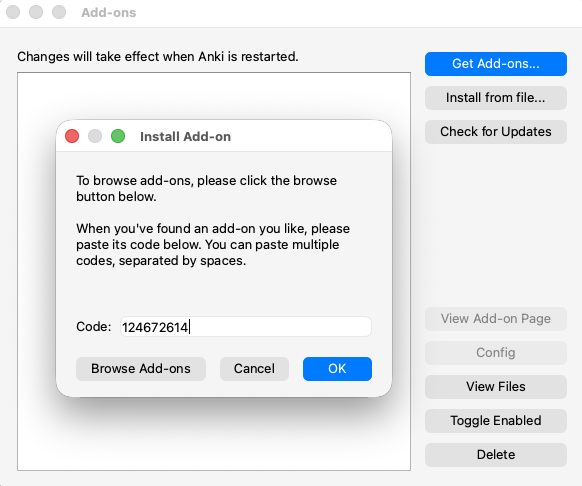

## Step 2: Connect the tunnel and sign in

Now turn on the tunnel so your Anki gets a public web address.

1. Go to **Tools → AnkiMCP Server Settings...**
2. Click **Connect Tunnel**.
3. A login dialog shows a one-time code. Click **Open Browser** and enter that code on the page that opens.
4. Approve the sign-in. The add-on saves your login, so you won't repeat this each time.

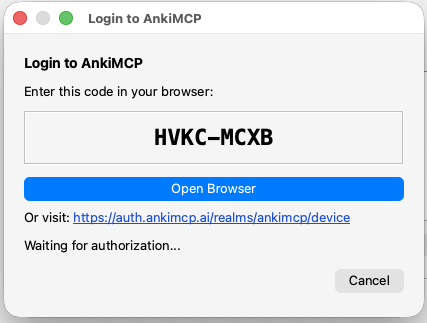

## Step 3: Copy the tunnel URL

The tunnel address is the same for everyone:

```text
https://tunnel.ankimcp.ai/mcp
```

It's safe to share, because it only works after you sign in — requests reach your Anki only when the AI app is signed in with **your** account. Copy that URL. You'll paste it into Grok next.

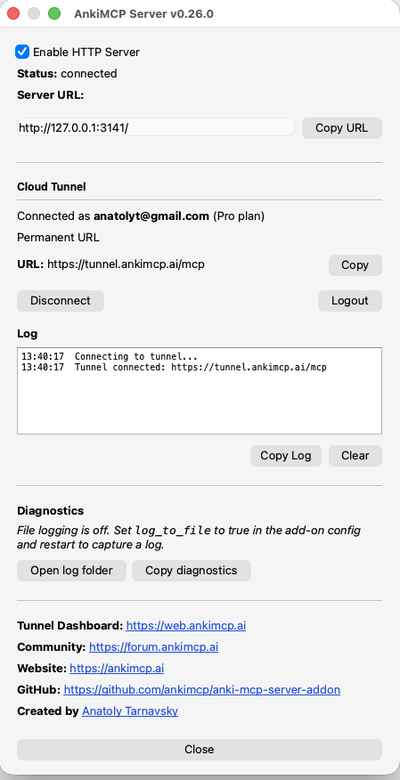

## Step 4: Add the tunnel to Grok

Open [grok.com](https://grok.com) in your browser and add the tunnel as a custom connector.

1. In the left sidebar, click **Plugins** near the bottom.

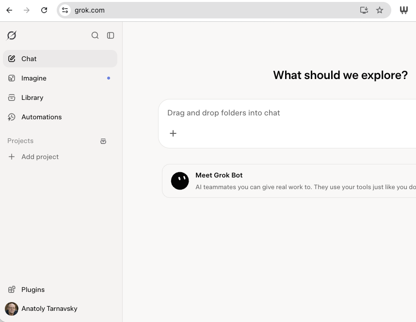

2. On the **Connectors** tab, click **New Connector** in the top-right corner.

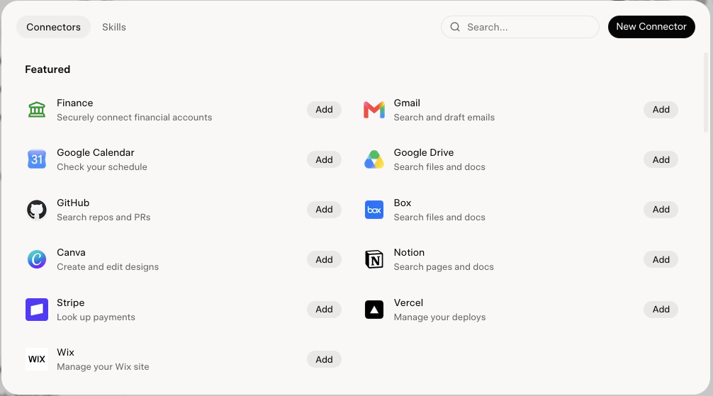

3. In the **New Connector** dialog, click **Custom** at the top, above the featured connectors.

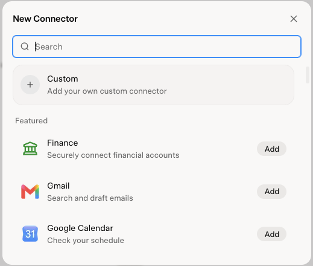

4. Fill in the **Custom Connector** form: a **Name** like `AnkiMCP.ai`, and the tunnel URL in **Server URL**. The placeholder ends in `/sse`; ignore it, your URL ends in `/mcp`. Click **Add Connector**.

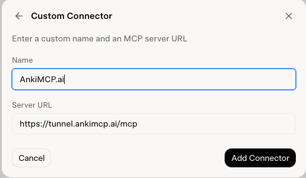

5. AnkiMCP opens and asks you to **Grant Access to Grok**. Sign in if prompted, then click **Yes**.

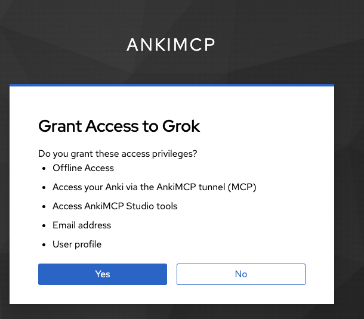

6. Back in Grok, AnkiMCP.ai now shows under **Connected** on the Connectors tab. Click it to see the Anki tools Grok can use, plus **Reauthenticate** and **Disconnect** buttons.

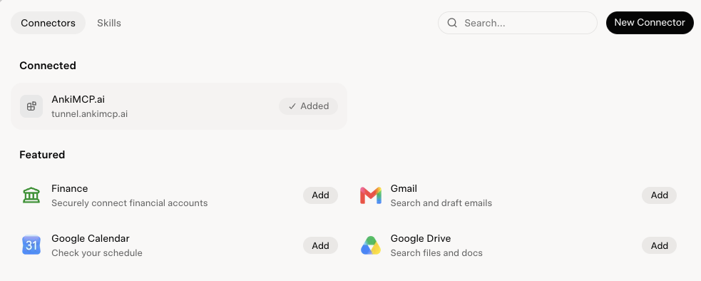

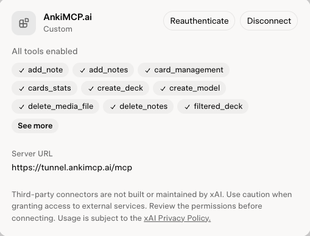

## Check it worked

Keep Anki open, then start a new chat. Click the **+** button in the message box, open **Connectors**, and make sure the **AnkiMCP.ai** toggle is on. Then ask: **"Can you fetch a list of my decks?"**

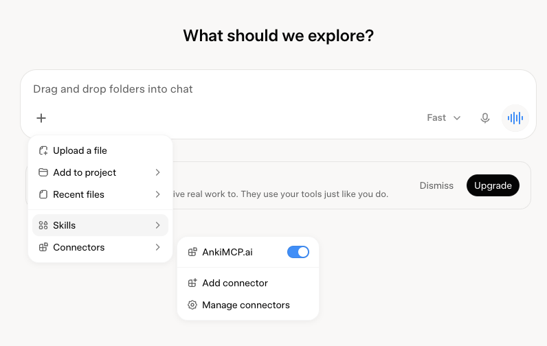

If Grok names your real decks and card counts, the tunnel works. You can now ask it to make cards, search your collection, or review with you.

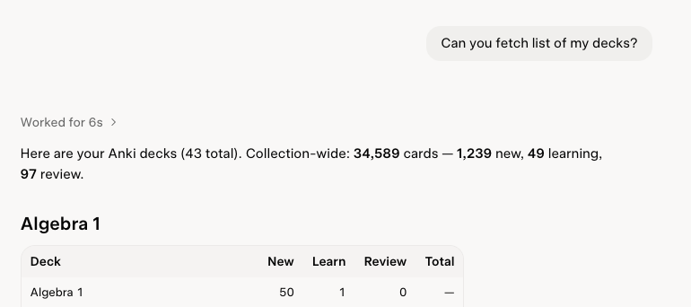

## Fix common problems

**Grok can't connect.**
Make sure Anki is open and the tunnel shows as connected in **Tools → AnkiMCP Server Settings...**. The tunnel only relays while Anki is running. Reconnect the tunnel if needed.

**Grok connects but sees no decks.**
Anki itself may be closed. Open Anki and confirm the tunnel is connected in **Tools → AnkiMCP Server Settings...**.

**Grok doesn't use the connector.**
Open the **+** menu in the message box, go to **Connectors**, and check that the AnkiMCP.ai toggle is on for this chat.

**Grok asks me to sign in again.**
Open **Plugins → Connectors**, click AnkiMCP.ai, and click **Reauthenticate**.

**Sign-in didn't open my browser.**
The login dialog shows a backup link and code. Open the link and enter the code to approve.

## Common questions

**Do I have to pay?**
The add-on is free. The tunnel has a free tier to get started and a paid tier for higher limits — see [pricing](/pricing/).

## Next steps

- New to local vs. remote? Read [Remote vs local access](/docs/concepts/remote-vs-local/) to choose the right path.
- Want better cards? Try these [AI prompts for Anki](/docs/how-to/anki-ai-prompts/).

---

*Disclaimer: "Anki" is a registered trademark of Ankitects Pty Ltd. AnkiMCP is an independent, community-built project and is **not** affiliated with, endorsed by, or sponsored by Ankitects. MCP is an open standard originated by Anthropic; AnkiMCP is likewise not affiliated with or endorsed by Anthropic. Grok is a product of xAI; AnkiMCP is not affiliated with or endorsed by xAI.*
