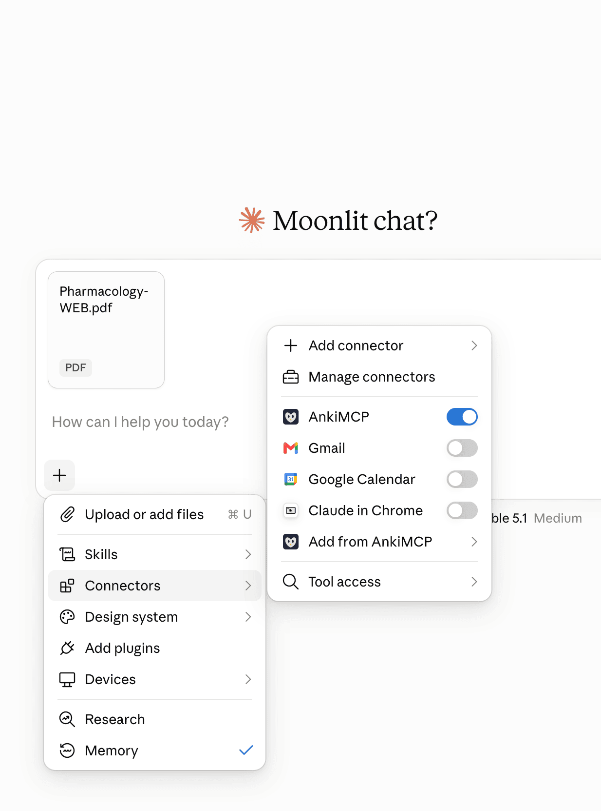
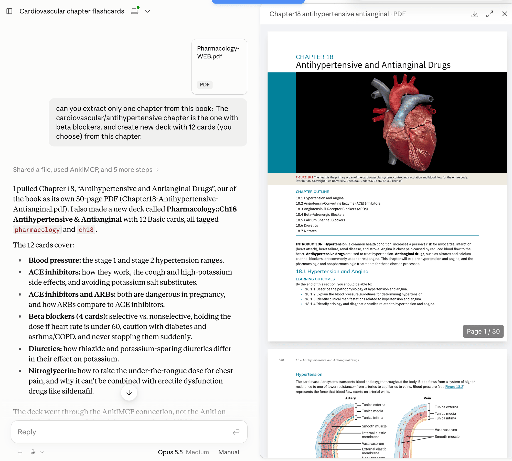
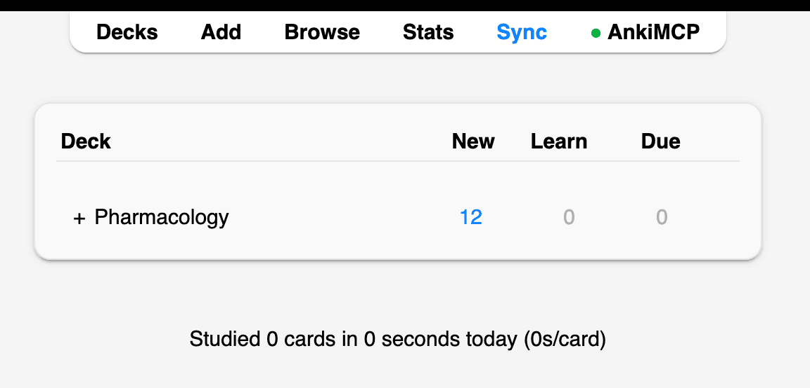
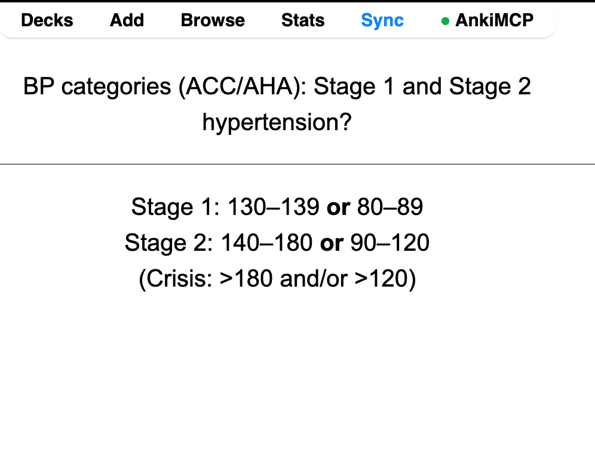
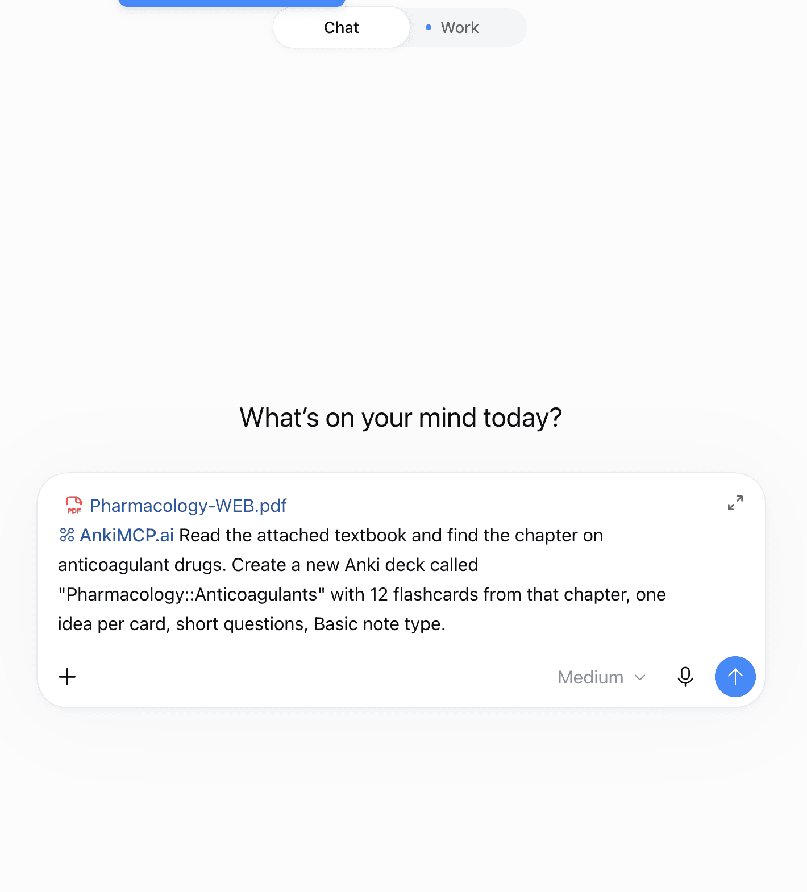
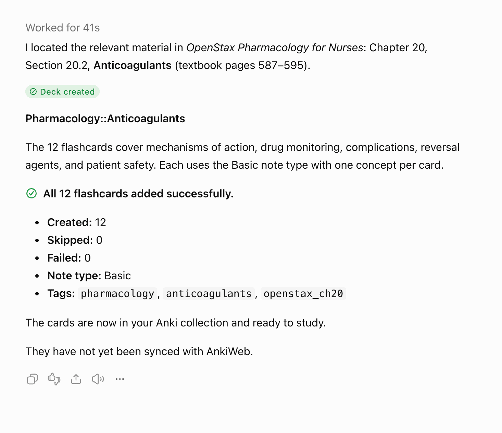

**Anki can't import a PDF directly, so you have three ways to turn one into flashcards. You can copy the text into Anki and write the cards yourself. You can have any AI chatbot write the cards as a text file, then import that file into Anki. Or, with AI connected to Anki, you attach the PDF in the chat and the cards appear in your deck.**

This guide covers all three, starting with the free routes that work with plain Anki. "PDF to Anki" is sometimes searched as pdf2anki. No matter what you call it, the steps below are the same.

## The standard Anki way (no add-on needed)

Anki has no PDF import. **File → Import** reads Anki decks (`.apkg`) and plain text files, but not PDFs. So the standard way is to get the text out of the PDF and into Anki yourself.

**For a few cards**, type them in by hand:

1. Open the PDF next to Anki.
2. In Anki, click **Add**.
3. Write one idea per card: a short question on the front, the answer on the back.
4. Click **Add** to save, and repeat.

**For many cards**, import a text file instead:

1. Make a plain text file where each line is one card: the front, a **Tab**, then the back.
2. Save it as `.txt` (or `.csv`).
3. In Anki, go to **File → Import** and pick the file.
4. Check that the separator is set to **Tab**, choose your note type (Basic works) and deck, then click **Import**.

A file with two cards looks like this (the gap between front and back is a single Tab):

```text
What does ATP stand for?	Adenosine triphosphate
Where is ATP mainly made in the cell?	The mitochondria
```

You don't have to write that file by hand. Copy the text of a PDF section into ChatGPT, Claude, or any other chatbot and ask:

```text
Turn the text below into Anki flashcards, one idea per card.
Output plain text only: one card per line, the question, then a
Tab, then the answer. No numbering, no headers.

[paste the PDF text]
```

Copy the reply into a text editor, save it as `.txt`, and import it with **File → Import**. This route is free and works with any chatbot.

The catch is the extra steps every time: copy the text, save a file, import it, and fix bad cards one by one in Anki. The AI way below skips all of that.

## The AI way: attach the PDF and the cards appear in Anki

With AnkiMCP, your AI is connected to your Anki collection. There's no converter and no import step. You attach the PDF in the chat, ask for cards, and the AI adds them straight into the deck you name. You can then fix or add cards in the same chat.

## What you need

- **The AI already connected to Anki.** If you haven't done this yet, see [Connect Claude to Anki](/docs/how-to/connect-claude/) or [Connect ChatGPT to Anki](/docs/how-to/connect-chatgpt-to-anki/).
- **Anki open** on your computer, or a [Hosted Anki](/docs/hosted-anki/) instance.
- **The PDF file**, saved on your computer.

## Step 1: Attach the PDF in the chat

Use your AI app's own attachment button, the **paperclip** or **+** in the message box. Pick the PDF and it attaches to your message.


**Attach the PDF with the chat app, not by file path.** For images and audio, you can [give the AI a file's path](/docs/how-to/add-images-to-cards/) and AnkiMCP fetches it. That only works for image, audio, and video files. Other file types, including PDFs, are blocked for safety. So for a PDF, always use the attachment button.




**Large PDFs:** You can attach a whole textbook and ask the AI to pull out one chapter first, then make cards from that chapter — that's what the screenshot below shows. AI apps do limit how big a file can be, so if yours refuses the file, attach a page range or copy and paste the part you want cards from. Smaller pieces also give you better cards.

## Step 2: Ask for cards

Type your request in plain words. Say which part of the PDF, what kind of cards, and which deck.

For basic question-and-answer cards:

```text
Read the attached PDF and make Anki flashcards from chapter 18,
one idea per card. Keep questions short. Put them in my
"Pharmacology" deck.
```

For cloze (fill-in-the-blank) cards:

```text
Read the attached PDF and make Anki cloze cards from the section
on beta blockers. Blank out one key term per card and keep each
sentence short. Put them in my "Pharmacology" deck.
```

If the deck doesn't exist yet, the AI can create it.



For better cards, attach the built-in `twenty_rules` prompt in Claude first. It coaches the AI to write short, single-idea cards. See [Anki AI prompts](/docs/how-to/anki-ai-prompts/) for how to attach it.

## Step 3: Refine in the same chat

The cards are already in Anki, but the chat isn't over. Ask for changes the same way you'd ask a person:

```text
Split card 4 into two cards.
```

```text
Add the page number from the PDF to the back of each card.
```

```text
Make 10 more cards from section 2.3.
```

The AI updates the cards in your deck directly. When you're happy with them, ask it to quiz you:

```text
Quiz me on the cards you just made, one at a time.
```

In Claude, the built-in `anki_review` prompt runs a full review session and rates each card for you. See [Anki AI prompts](/docs/how-to/anki-ai-prompts/). To review out loud, see [Review Anki by voice](/docs/how-to/review-anki-by-voice/).

## Check it worked

Open the deck in Anki. The new cards should be there, one idea per card, in the deck you named.



Click the deck and start studying to see the cards the AI wrote.



If you sync to AnkiWeb, sync now so the cards reach your phone and other devices.

## Converter apps vs. AI connected to Anki

Dedicated PDF-to-Anki converter sites also exist. You upload a PDF, they generate cards, and you download a deck file to import. Here's how the three routes compare:

| Route | Steps | Cost | Edit after creation? | Review in chat? |
|---|---|---|---|---|
| **By hand / text file import** | Copy text, write cards or a Tab-separated file, import | Free | Yes, by hand in Anki | No |
| **PDF converter site** | Upload PDF, generate, download `.apkg`, import into Anki | Varies by site | By hand in Anki, or regenerate and re-import | No |
| **AI connected to Anki (AnkiMCP)** | Attach PDF, ask, cards land in your deck | Free add-on; the remote tunnel has a [free and a paid tier](/pricing/), plus whatever your AI app costs | Yes, ask the AI in the same chat | Yes |

If you only need cards from one PDF once, either free route above works fine. AI connected to Anki is worth it when you make cards often and want to fix and study them without leaving the chat.

## Fix common problems

**The AI says it can't open the PDF.**
The PDF is likely a scan: pictures of pages with no real text inside. You can tell if you can't select any text in a PDF viewer. Run it through an OCR tool first (many PDF apps have one), or type or paste the text you need into the chat.

**The cards are too long.**
Attach the `twenty_rules` prompt and ask again, or say "one fact per card, answers under 10 words." You can also ask the AI to split the long cards it already made.

**Cards went to the wrong deck.**
Name the deck exactly as it appears in Anki, in quotes. If the cards already landed somewhere else, ask the AI to move them: "Move the cards you just made to my Pharmacology deck."

**The AI didn't add anything to Anki.**
Anki may be closed, or AnkiMCP isn't connected in this chat. Open Anki, check the connection, and ask again. See [Troubleshooting](/docs/how-to/troubleshooting/).

## Common questions

**Can Anki import a PDF?**
No, not directly. Anki imports deck files (`.apkg`) and text files, not PDFs. You need to get the text out first, by hand or with AI.

**Is there a free way to turn a PDF into Anki cards?**
Yes. Both standard routes above are free: type the cards in Anki, or have any chatbot write a Tab-separated text file and import it. AnkiMCP's add-on is free too, and the tunnel has a free tier.

**Does this work with ChatGPT?**
Yes, once ChatGPT is connected to Anki. Follow [Connect ChatGPT to Anki](/docs/how-to/connect-chatgpt-to-anki/), then attach the PDF in your chat and mention **@AnkiMCP.ai** in the same message so ChatGPT uses it to add the cards.



ChatGPT finds the right chapter in the whole textbook on its own, creates the deck, and reports what it added.



## Next steps

- New here? Start with [Get started](/docs/get-started/).
- Want better cards faster? See [Anki AI prompts](/docs/how-to/anki-ai-prompts/).
- Want diagrams from the PDF on your cards? See [Add images to cards](/docs/how-to/add-images-to-cards/).
- See [Every way to use AI with Anki](/docs/concepts/anki-ai/).

---

*Disclaimer: "Anki" is a registered trademark of Ankitects Pty Ltd. AnkiMCP is an independent, community-built project and is **not** affiliated with, endorsed by, or sponsored by Ankitects. MCP is an open standard originated by Anthropic; AnkiMCP is likewise not affiliated with or endorsed by Anthropic.*
