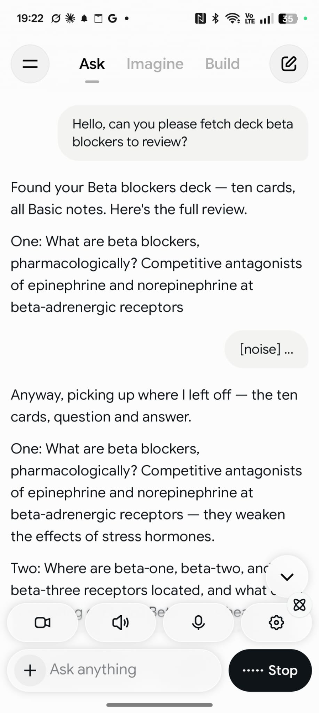

**Review your Anki cards by voice while you walk, drive, or ride the train. Start a voice chat in Grok, say which deck to review, answer each card out loud, and rate it by voice. Anki records the reviews as if you'd done them at your desk.**

Right now **Grok is the only AI app where this fully works**. It runs the AnkiMCP connector inside voice mode, so it can pull your due cards, read them to you, and save your ratings while your phone stays in your pocket. ChatGPT and Claude both connect to Anki, but their voice modes don't use connectors yet. When that changes, the same steps will work there too.

## What you need

- **The Grok mobile app** on iOS or Android, signed in to the same account you use on grok.com.
- **AnkiMCP connected to Grok.** If you haven't done that yet, follow [Connect Grok to Anki](/docs/how-to/connect-grok-to-anki/) first. It takes about 5 minutes and you only do it once.
- **Anki open on your computer at home**, with the tunnel connected. Grok reaches your cards through the tunnel, so Anki has to stay running while you review.
- **Earbuds**, unless you like talking to your phone in public.

**Time:** as long as your review takes. Ten cards is a few minutes.

## Why this works

The AnkiMCP add-on gives the AI three review tools: one to fetch the next due card in true scheduler order, one to show the question and then the answer, and one to rate the card (Again, Hard, Good, Easy). Grok's voice mode can call those tools mid-conversation. So a voice review is a normal Anki review, just with Grok reading and listening instead of you tapping. Your intervals, your FSRS scheduling, and your streak all update the same way.

## Step 1: Start a voice chat with the connector on

1. Open the Grok app and start a **new chat**.
2. Tap the **+** button, open **Connectors**, and make sure **AnkiMCP.ai** is switched on. It usually stays on from last time.
3. Tap the **voice** button to enter voice mode.

## Step 2: Ask for a review, one card at a time

Name the deck and tell Grok how to run it. Both parts matter:

> "Let's review my Spanish deck. One card at a time: read the question, wait for my answer, then read the answer and ask me to rate it."

If you only say "let's review my Spanish deck", Grok tends to fetch the whole deck and read every question and answer back to back, like a podcast. That's fine for a passive listen, but it's not a review and nothing gets rated. The screenshot below shows exactly that happening with a plain prompt.

With the fuller prompt, Grok fetches your first due card and reads the front. Answer out loud. Grok reads the back, then asks how it went.

## Step 3: Rate each card by voice

Answer with the same four words Anki uses:

- **"Again"** if you got it wrong.
- **"Hard"** if you got it but it was a struggle.
- **"Good"** if you got it.
- **"Easy"** if it was trivial.

Grok saves the rating in Anki and moves to the next card. Plain speech works too, like "I got that one" or "no idea", but the four Anki words are the most reliable.

To stop, just say **"That's enough for today"**. Everything you rated is already saved.

## Tips that make it smoother

**Pick one deck.** "Review my Japanese vocab deck" works better than "review everything". Grok stays focused and you know what's coming.

**Cap the session.** Say "let's do 20 cards" up front. A commute is a fixed length; a review queue isn't.

**Skip cards with images or audio.** Say "skip cards that have pictures". The add-on can filter those out when it fetches due cards, so you won't get a card Grok can't read to you.

**Ask for the answer only after you've tried.** If Grok blurts out the back too early, say "wait for my answer before you read the back". It adjusts for the rest of the session.

**Mind the noise.** Voice mode listens all the time. On a loud train it can take a passing announcement as your answer and restart, which you can see in the screenshot above. Earbuds with a mic help, and so does pausing Grok with the stop button while you're in a noisy stretch.

**Cloze cards work, but sound odd.** Grok reads the sentence with a gap, you fill it in. Fine for language cards, awkward for long science sentences.

## Check it worked

When you get home, open Anki and look at the deck. The due count should be lower, and the cards you rated will show new intervals. If you want proof, open the card browser and sort by last review; your commute cards will be at the top with today's timestamp.

## Fix common problems

**Grok says it can't reach Anki.**
Anki is closed or the tunnel dropped. This is the number one cause. Anki must be open on your computer, and **Tools → AnkiMCP Server Settings...** must show the tunnel as connected.

**Grok reads deck names but won't review.**
The connector is on but Grok picked the wrong tool. Say "use present card to show me the next due card" once. After that it usually stays on track.

**Grok reads the whole deck, questions and answers together.**
Your prompt didn't ask for one card at a time. Say "stop, let's do this one card at a time: question first, wait for my answer, then the answer". It remembers for the rest of the session.

**Ratings aren't showing up in Anki.**
Grok may have skipped the rating step. Ask it "did you rate that card?" If not, say the rating again. Check the card browser afterward to confirm.

**Grok reads HTML or formatting.**
Some cards carry markup from imports or add-ons. Ask Grok to "read the plain text only". If a deck is full of it, cleaning the cards once at your desk is the real fix.

## What about ChatGPT and Claude?

Both connect to Anki the same way, through the AnkiMCP tunnel. See [Connect ChatGPT to Anki](/docs/how-to/connect-chatgpt-to-anki/) and [Connect Claude to Anki](/docs/how-to/connect-claude/). In text chat, both can run a review session, and Claude has a built-in [Review session prompt](/docs/how-to/anki-ai-prompts/) for it.

The gap is voice. As of September 2026, neither ChatGPT's nor Claude's voice mode calls custom connectors, so a spoken review can't reach Anki. When either adds that, this page will cover it. Until then, Grok is the one to use on your commute.

## Next steps

- Not connected yet? Start with [Connect Grok to Anki](/docs/how-to/connect-grok-to-anki/).
- Want better cards to review? Try these [AI prompts for Anki](/docs/how-to/anki-ai-prompts/).
- Curious what else the add-on can do? See the [tool reference](/docs/reference/addon/tools/).

---

*Disclaimer: "Anki" is a registered trademark of Ankitects Pty Ltd. AnkiMCP is an independent, community-built project and is **not** affiliated with, endorsed by, or sponsored by Ankitects. MCP is an open standard originated by Anthropic; AnkiMCP is likewise not affiliated with or endorsed by Anthropic. Grok is a product of xAI; AnkiMCP is not affiliated with or endorsed by xAI.*
